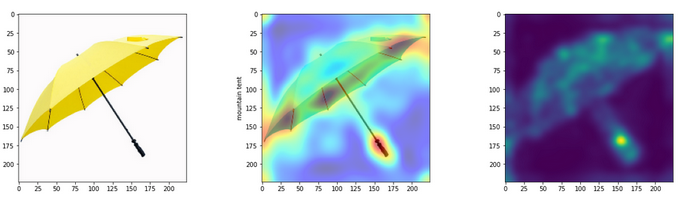
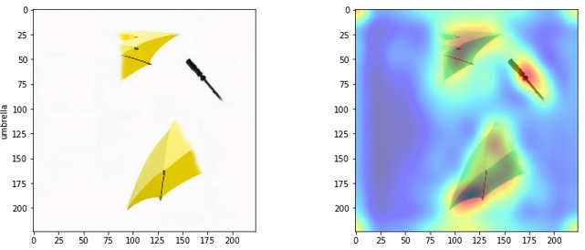
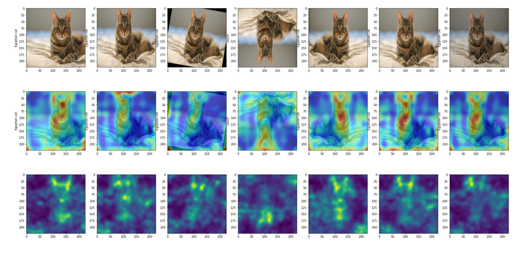

# XAI - Classification and Object Detection
This repository contains code and explainations of XAI algorithms.  

Explainability/Interpretability in DNN is essential because if we need to deploy the models in real-life scenarios like self-driving cars or in medical diagnosis, we can’t just rely on a black box to make predictions for us. We need to be sure that the model will work accurately in possible conditions.    
Implementation:  
1. Saliency Map
2. Grad-CAM    
  
  

### For viewing the code and results
Jupyter Notebook: [XAI-Notebook](https://nbviewer.jupyter.org/github/ankurbhatia24/XAI/blob/master/Visualize_XAI.ipynb)

### For reproducing the results run the following commands in the command line:
1. git clone https://github.com/ankurbhatia24/XAI.git
2. cd XAI/
3. jupyter-notebook Visualize_XAI.ipynb
Run the cells sequentially to produce the results. You can tweak the parameters for augmentation and also test your own images.  

### For Details and References
Please refer to the doc for more details of the implementation, references and explainations on the results: [document](https://github.com/ankurbhatia24/XAI/blob/master/XAI%20-%20Document%20(ANKUR%20BHATIA).pdf)  

